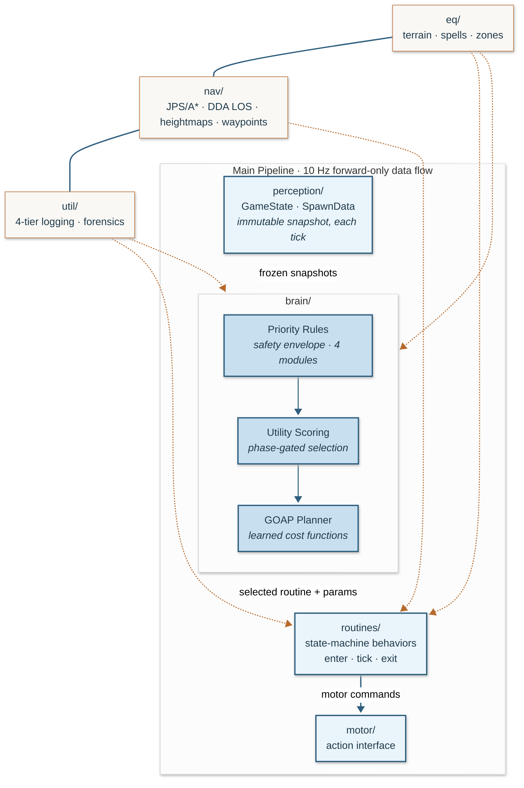
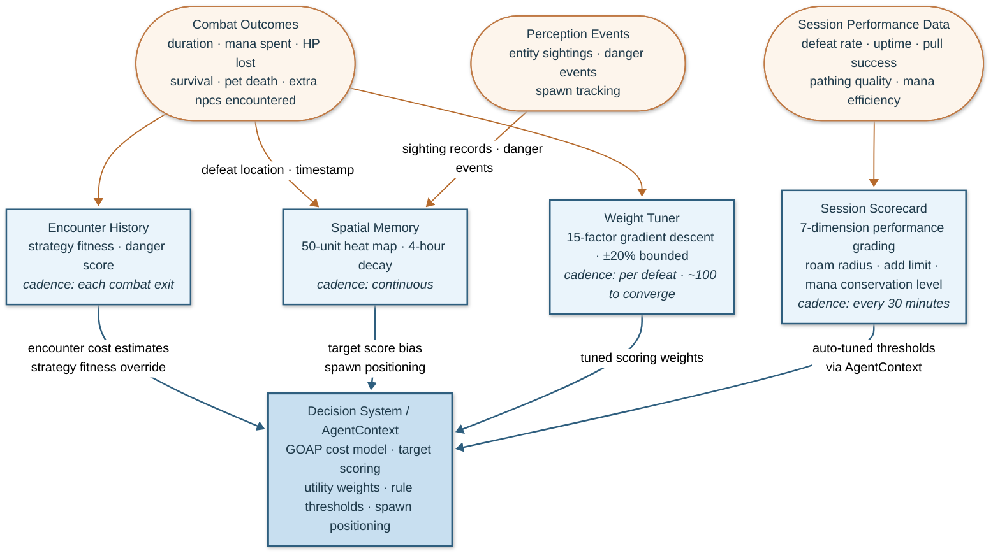

# Compass


-blue.svg>)

A layered decision architecture for intelligent behavior in a real-time 3D world.

<p align="center">
  
</p>

Compass is a control architecture for agents that must perceive, decide, and act in a 3D world under partial observability, noisy state, terrain hazards, resource pressure, and constant interruption. It layers priority rules, utility scoring, and goal-oriented planning. Routines carry out those decisions without blocking and remain interruptible under threat. Encounter history, spatial memory, and geometry-aware navigation let the agent adapt as conditions shift.

The architecture evolved in a legacy 3D MMORPG sandbox. It progressed from a monolith through reactive rules, state-machine routines, and utility scoring before arriving at goal-oriented planning. Each transition came when the previous approach broke against the world's complexity.

> **Scope.** This is a cleaned extraction from a private working repo, published as an architecture reference. Live runtime config, environment assets, and operational glue are intentionally omitted. See [docs/samples/](docs/samples/) for real session output.

---

## Architecture

The system is organized as a four-stage control pipeline: perception, brain, routines, and motor, with environment parsers, navigation, and observability as support layers. It runs as a single 10 Hz loop with zero runtime dependencies beyond the Python 3.14 standard library. That core is surrounded by priority rules across four modules, state-machine routines with enter/tick/exit lifecycles, swappable combat strategies, JPS/A\* pathfinding with DDA line-of-sight on 1-unit heightmaps, and a GOAP planner with learned cost functions.

Data flows through four stages in strict forward-only order:



No module imports upward. The dependency graph is a DAG, and each layer is independently understandable.

The **brain thread** runs at 10 Hz: read state, evaluate the decision stack, tick the active routine, issue motor commands. A single cycle runs in well under 100ms. A secondary thread handles observability output and runtime control signals. Thread safety between them comes from immutable perception snapshots: frozen `GameState` dataclasses produced each tick, never modified after creation. No locks, no races.

### Perception

The perception layer reads live environment state by traversing struct pointer chains via `ReadProcessMemory` in read-only mode, with no code injection. Each tick produces immutable snapshots: a `GameState` covering player stats, position, target, and cast state, and a `SpawnData` per visible entity. The interface between perception and brain is this snapshot contract; everything above it is environment-agnostic.

### The Decision Stack

The brain runs a three-layer decision stack. Each layer adds capability; the layers below provide guarantees. See [`docs/architecture.md`](docs/architecture.md#decision-architecture) for the full decision flow diagram.

**Priority rules** are the safety envelope. Rules across four modules (survival, combat, maintenance, navigation) evaluate every tick in priority order. Emergency rules (FLEE, FEIGN_DEATH, EVADE) carry hard priority over everything: they can interrupt any locked routine, invalidate any active plan. This guarantee is structural, not learned. The agent cannot learn its way into ignoring a lethal threat.

**Utility scoring** operates within the safety envelope. Non-emergency rules produce float scores reflecting "how valuable is this action right now?" Five selection phases are configurable at runtime: Phase 0 ignores scores (conservative baseline), Phase 1 logs divergences without changing behavior (observation mode), Phase 2 uses scores within priority tiers, Phase 3 uses weighted cross-tier comparison, Phase 4 uses declarative consideration-based scoring with weighted geometric mean. This escalation path allows the scoring system to be validated before it influences decisions.

**GOAP planning** generates multi-step action sequences toward explicit goals: survive, gain XP, manage resources. The planner uses A\* on the goal state space, not the terrain, with preconditions, effects, and learned cost functions per action. Plans run 3–8 steps and are generated once per routine completion or on plan invalidation (budget: <50ms). Candidate plans are evaluated via Monte Carlo rollouts: action effects are sampled stochastically from learned posterior distributions to estimate expected plan value under uncertainty, so a plan that performs well across noisy outcomes is preferred over one that looks optimal only under point estimates. The relationship to the priority system is explicit: GOAP proposes, priorities dispose. Each tick, the current plan step's routine receives a score boost in the utility selection phase; emergency rules evaluate first and invalidate the plan if any fires. Spawn prediction (Poisson process from defeat timestamps) feeds both the planner's positioning decisions and the wander routine's directional bias.

### Routines

Behaviors are implemented as state machines with an `enter` / `tick` / `exit` lifecycle. The contract: `tick()` must return within 200ms. No blocking sleeps, no polling loops; routines advance through phases, check conditions, and return `RUNNING` each tick until complete. The brain evaluates emergency rules between every tick; the agent can always flee regardless of what routine is running.

Lock-in semantics (`locked = True`) protect multi-step sequences from premature interruption. A pull mid-flight, a death recovery sequence, a multi-step engagement: once locked, only emergency rules can override. Without this, lower-priority rules interrupt half-completed actions the moment they momentarily become relevant.

### Navigation

Zone terrain is parsed from the environment's own 3D geometry into 1-unit-resolution heightmaps with walkability, water, lava, cliff, and obstacle surface types. JPS (Jump Point Search) is the primary pathfinding algorithm, pruning symmetric paths on the grid for speed, with A\* as a fallback when JPS exhausts its node budget in dense terrain. Both use octile-distance heuristics, bitfield-accelerated walkability checks, Z-gradient penalties, and dynamic avoidance-zone cost inflation. Pre-built cache files persist across sessions.

Line-of-sight uses DDA (Amanatides-Woo) grid traversal, visiting every cell the ray crosses exactly once with no sampling gaps. Obstacle flags and interpolated ray Z are checked per cell. Movement validates the path ahead with predictive obstacle scanning and computes perpendicular detours before hitting hazards, rather than relying on stuck recovery alone.

For areas where grid pathfinding cannot resolve vertical ambiguity (bridges, tunnels, spiral ramps, overlapping geometry), pre-recorded waypoint graphs provide known-safe routes. A zone graph with BFS computes multi-zone paths for long-distance travel.

---

## Learned Adaptation

The agent improves from its own experience. All four learning systems train on the same signal: encounter outcomes.

**Encounter history.** Every combat exit records 20 fields: duration, mana spent, HP lost, strategy used, pet deaths, extra npcs encountered. Bayesian conjugate posteriors (Normal for continuous values, Beta for rates) are maintained per entity type and updated incrementally with each encounter. The target scoring path draws from these posteriors via Thompson Sampling, naturally balancing exploration of uncertain targets against exploitation of known-good ones. As data accumulates, posteriors tighten and selection stabilizes without requiring a hardcoded exploration schedule. Data persists across sessions. Per-encounter regret (chosen target fitness vs best-available) is tracked; sublinear cumulative regret growth validates that the learning converges.

**Spatial memory.** A heat map on a 50-unit grid tracks defeats, sightings, and danger events with 4-hour exponential decay. Heat biases target scoring by up to 50%, directing the agent toward productive areas. The GOAP planner uses per-cell Poisson spawn prediction (derived from defeat timestamps) to position toward predicted respawns rather than wandering randomly.

**Session scorecard.** Every 30 minutes, a 7-dimension scorecard grades defeat rate, survival, pull success, uptime, pathing, mana efficiency, and targeting. Three parameters auto-tune immediately: roam radius, social add limit, and mana conservation level.

**Scoring weight tuning.** The 15-factor target scoring function tunes its weights via finite-difference projected gradient descent. Each gradient step perturbs weights independently, measures the effect on encounter fitness through centered numerical derivatives, and applies the update projected back into the bounded region (±20% of defaults). Adaptive per-weight learning rates detect oscillation, convergence, and stagnation. Convergence takes ~100 defeats per zone.

The GOAP planner's cost functions draw directly from this learned data. Rest costs come from observed rest durations. Encounter costs come from per-entity history. As the cost model converges, plan quality improves with it.



---

## Observability

Every decision branch logs its reasoning. A silent `return False` is treated as a defect; it makes the corresponding behavior invisible in post-session analysis. Hot-path logging (scoring functions running per-entity per-tick) is rate-limited to avoid volume problems.

Four tiers provide graduated detail:

| Tier | Level   | Volume           | Purpose                                                |
| ---- | ------- | ---------------- | ------------------------------------------------------ |
| T1   | EVENT   | ~50 lines/hr     | State changes: defeats, deaths, zone transitions       |
| T2   | INFO    | ~2,000 lines/hr  | Operational flow: routine enter/exit, target selection |
| T3   | VERBOSE | ~5,000 lines/hr  | Decision branches: rule skips, scoring breakdowns      |
| T4   | DEBUG   | ~50,000 lines/hr | Raw data: memory reads, motor output, tick timing      |

Each session produces 6 output files: 4 log files (one per tier threshold), a structured JSONL event stream, and a decision receipt log. A 300-tick forensics ring buffer captures brain state continuously and flushes to disk on death: 30 seconds of pre-incident telemetry for every failure.

### Session Samples

All samples in [docs/samples/](docs/samples/) are real output from live sessions, not hand-written examples:

| Sample                                                           | What it shows                                                                                                        |
| ---------------------------------------------------------------- | -------------------------------------------------------------------------------------------------------------------- |
| [Session tiers](docs/samples/session-tiers.md)                   | One session viewed through all 4 log tiers: EVENT arc, INFO routine flow, VERBOSE rule cascade, DEBUG motor commands |
| [Decision trace](docs/samples/decision-trace.md)                 | 18 decision receipts showing WANDER → ACQUIRE → PULL (locked) → IN_COMBAT with tick timing and rule evaluation       |
| [GOAP plan](docs/samples/goap-planner.md)                        | Plan generation, step-by-step cost accuracy (estimated vs actual), and plan completion                               |
| [Forensics buffer](docs/samples/forensics-ring-buffer.md)        | 300-tick ring buffer dump: skeleton aggro interrupts spell memorization, FLEE fires within one tick                  |
| [Learned encounter data](docs/samples/learned-encounter-data.md) | Cross-session improvement: grade B → A, fight duration 29.5s → 15.9s, auto-tuned parameters drifting from defaults   |
| [Fight event](docs/samples/structured-fight-event.md)            | Structured `fight_end` event with all 20 fields and embedded world snapshot                                          |
| [Convergence](docs/samples/convergence.md)                       | 10-session headless run: fight duration drops 53% as encounter history accumulates and cost functions self-correct    |
| [Ablation results](docs/samples/ablation-results.md)             | Learning vs. defaults: 97% GOAP cost error reduction, 25x danger discrimination, weight tuning stability             |

---

## Headless Simulator

The simulator runs the full decision stack (brain, rules, GOAP, learning) against synthetic perception sequences. No game client, no environment assets, no external dependencies.

```bash
just simulate                                      # replay: single camp session
just simulate converge --sessions 10               # convergence: learning across sessions
just simulate replay --scenario survival_stress     # stress: safety envelope under pressure
just simulate benchmark --scenario camp_session     # benchmark: 10 Hz realtime pacing
```

Three built-in scenarios exercise different system paths: `camp_session` (pull/combat/rest cycles, target scoring, encounter learning), `survival_stress` (escalating damage, flee urgency, emergency rules), and `exploration` (sparse targets, GOAP planning, spatial memory). Results include tick timing percentiles, decision stack activity, GOAP plan statistics, and learning snapshots.

Convergence mode preserves learning state across sessions. Fight duration drops as encounter posteriors tighten and cost functions self-correct:

```
 Session  Grade  Fights   Avg Dur
       1      A       8    22.2s
       3      A      24    19.4s
       5      A      30    16.6s
      10      A      30    10.4s       53% improvement
```

See [docs/samples/convergence.md](docs/samples/convergence.md) for the full output and explanation.

---

## Reading the Code

After the top-level overview, read by subsystem. Start with any rule module in [`brain/rules/`](src/brain/rules/) to see how conditions and score functions are written. Then inspect [`brain/goap/planner.py`](src/brain/goap/planner.py) for goal-directed sequencing, [`brain/world/model.py`](src/brain/world/model.py) for derived world intelligence, and [`brain/runner/loop.py`](src/brain/runner/loop.py) for the 10 Hz execution path. Combat strategies live in [`routines/strategies/`](src/routines/strategies/).

For a step-by-step trace of one tick from perception to motor output, see [`docs/walkthrough.md`](docs/walkthrough.md). For architecture details beyond the README, see [`docs/architecture.md`](docs/architecture.md). For design rationale, [`docs/design-decisions.md`](docs/design-decisions.md). For the full evolutionary arc, [`docs/evolution.md`](docs/evolution.md).

<details>
<summary><strong>Project Structure</strong></summary>

```
src/
  core/                  Cross-cutting primitives (types, constants, exceptions, features)
  runtime/               Agent wiring and session lifecycle
  perception/            Environment state reading (snapshot contract, pointer traversal)
  brain/                 Decision stack: priority rules, utility scoring, GOAP planner
  brain/state/           Typed sub-state dataclasses (combat, pet, camp, inventory, ...)
  brain/runner/          10 Hz tick loop, lifecycle management, level-up handling
  brain/world/           World model, entity tracking, anomaly detection
  brain/goap/            GOAP planner, world state, actions, goals, spawn predictor
  brain/learning/        Encounter history, spatial memory, scorecard, weight gradient
  brain/scoring/         Target scoring, utility curves, weight learner
  brain/rules/           Priority rules across 4 modules (survival, combat, maintenance, nav)
  routines/              State machine behaviors (enter/tick/exit)
  routines/strategies/   Swappable combat strategy implementations
  nav/                   JPS/A* pathfinding, DDA line-of-sight, waypoint graphs, zone graph
  nav/terrain/           1-unit heightmaps from zone geometry, obstacle detection
  motor/                 Action interface (movement, targeting, casting, stance)
  eq/                    Environment data parsers (geometry, spells, zone models)
  simulator/             Offline scenario runner for testing decisions without live environment
  util/                  Structured logging, event schemas, forensics, invariant checking
docs/                    Architecture, design decisions, evolution history, retrospective
```

</details>

Built with Python 3.14, zero runtime dependencies, and the standard library. See [docs/testing.md](docs/testing.md) for the test strategy and coverage philosophy.

---

## License

Released under the [MIT License](LICENSE).
