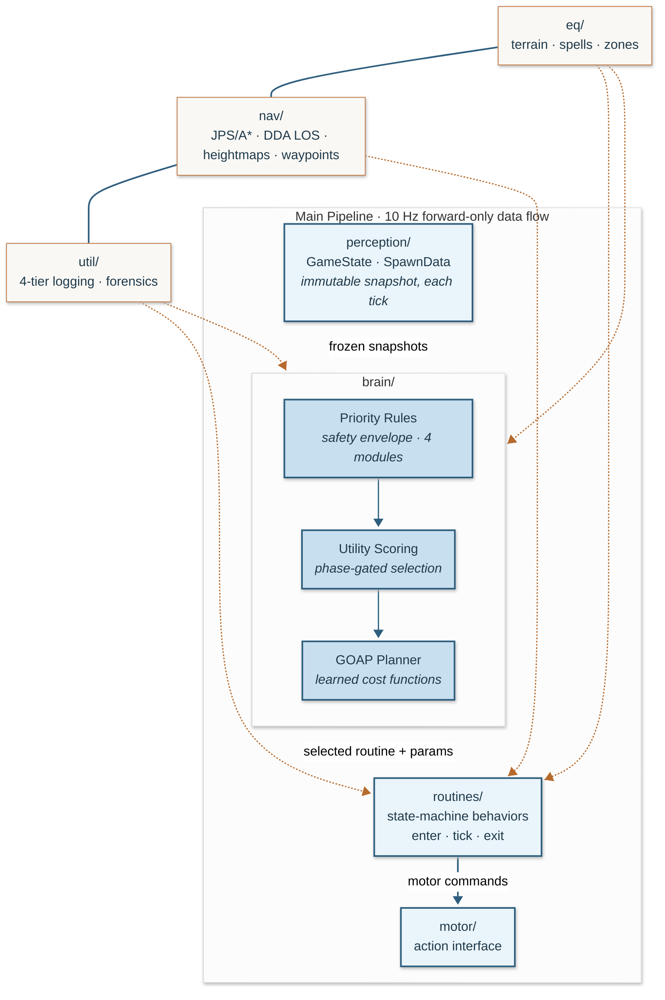
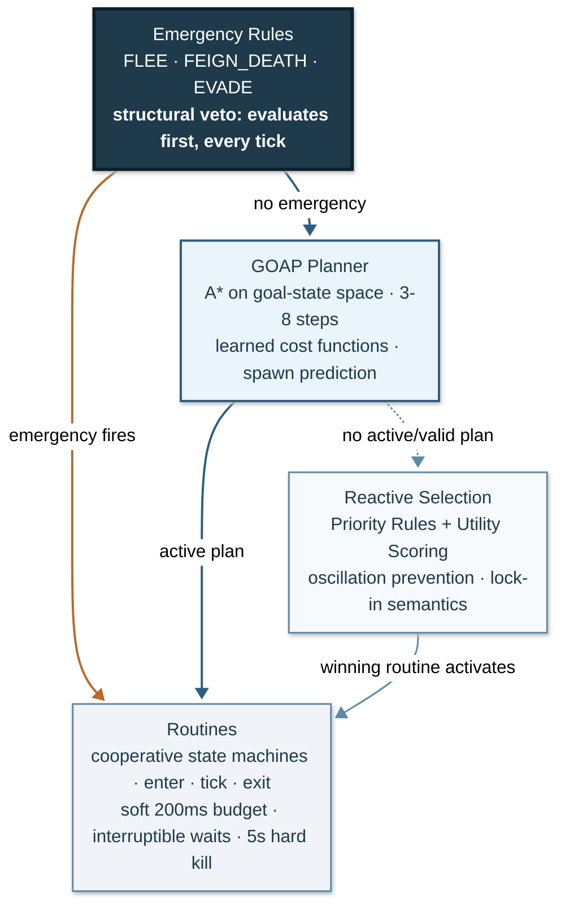
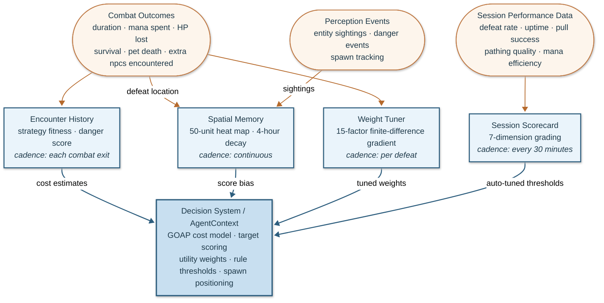

<!-- last_modified: 2026-03-25 -->

# Architecture

Technical overview of the system's structure, execution model, and major subsystems.

Compass is an autonomous agent architecture developed against Classic EverQuest as a complex real-time sandbox. It reads live world state via direct process memory access, plans multi-step action sequences through a goal-oriented planner constrained by a priority-rule safety envelope, learns from every encounter to improve scoring and cost estimates, and drives the game client through synthetic keyboard input.

The entire loop runs at 10 Hz with zero runtime dependencies beyond the Python 3.14 standard library.

---

## System Overview

Data flows through four stages in strict forward-only order:



No module imports upward. This is the primary architectural invariant: it prevents circular imports, keeps layers independently verifiable, and makes the dependency graph a DAG. This pipeline has absorbed every architectural addition since the pipeline decomposition (priority rules, utility scoring, learning loops, and goal-oriented planning) without structural change.

The **brain thread** runs as a 10 Hz daemon: reads state, evaluates the decision stack, ticks the active routine, issues motor commands. A single cycle runs in well under 100ms: read memory (~2ms), evaluate rules and planner (~2ms), tick the active routine (~1-5ms), issue motor commands (~1ms). A secondary thread handles logging output and structured event emission; it reads shared state through the frozen snapshot contract.

---

## Perception Layer

The perception layer reads live environment state from the game client process via `ReadProcessMemory` (Win32 API). No code injection or DLL hooks; the layer uses read-only external observation.

### Environment Coupling

The environment's memory layout is the sole coupling point between the perception layer and the specific environment. Struct layouts and pointer chains follow the environment's own internal data structures rather than absolute addresses, which makes reads stable across client sessions and restarts. The perception layer interface above this coupling (the frozen `GameState` and `SpawnData` snapshots) is environment-agnostic; everything above it in the stack depends only on that contract.

### Snapshots

Every 100ms, the perception layer produces immutable snapshots:

- **GameState**: frozen dataclass containing player position, heading, HP, mana, target info, casting state, zone ID, and the full spawn list.
- **SpawnData**: frozen dataclass per entity (players, NPCs, corpses) with position, HP percentage, name, spawn ID, distance, and heading.

Frozen dataclasses provide thread safety without locks. The brain thread produces snapshots; secondary readers consume them. No mutation after creation.

### Sub-Readers

Three specialized sub-readers handle distinct memory regions:

1. **Character reader**: player stats, buffs, casting state, mana, money, weight.
2. **Inventory reader**: equipment slots, bag contents, weight tracking.
3. **Spawn reader**: iterates the spawn linked list, producing SpawnData for every visible entity within range.

---

## Decision Architecture

The brain operates a three-layer decision stack. Each layer adds capability while the layers below provide guarantees:



The central design principle: **classical rules guarantee safety; learned scoring optimizes performance; planning optimizes sequences.** The three mechanisms operate at different levels and never conflict. Emergency rules evaluate first every tick regardless of what the planner proposed.

### Layer 1: Priority Rules (Safety Envelope)

Rules organized across four modules:

| Module      | Scope                                   |
| ----------- | --------------------------------------- |
| survival    | Flee, death recovery, emergency actions |
| combat      | Pull, engage, acquire targets           |
| maintenance | Rest, buff, heal pet, meditate          |
| navigation  | Travel, return to camp, unstick         |

Emergency rules (FLEE, DEATH_RECOVERY, FEIGN_DEATH) always use hard priority and can interrupt any active routine or GOAP plan. This guarantee is structural: the agent can never learn its way into ignoring a lethal threat.

Non-emergency rules participate in utility scoring (Layer 2) and GOAP planning (Layer 3) but remain available as a fallback when the planner has no active plan.

**Oscillation prevention.** Per-rule cooldowns prevent rapid rule switching. Circuit breakers suppress rules that fail repeatedly (5 failures in 300 seconds triggers a 120-second recovery window).

**Lock-in.** When a routine sets `locked = True`, only emergency rules can interrupt it. This protects multi-step sequences (e.g., a pull in progress) from being abandoned by a lower-priority rule that momentarily becomes relevant.

### Layer 2: Utility Scoring

Every non-trivial rule produces a score reflecting "how valuable is this action right now?" Five selection phases are configurable at runtime:

- **Phase 0**: Binary priority. First rule whose condition returns True wins. Scores computed but ignored. Conservative baseline.
- **Phase 1**: Divergence logging. Scores run in parallel. When score-based selection would differ from priority-based, the divergence is logged. No behavior change.
- **Phase 2**: Tier-based scoring. Within each priority tier, highest score wins. Between tiers, higher priority wins.
- **Phase 3**: Weighted cross-tier scoring. Emergency rules retain hard priority. Non-emergency rules compete by `weight * score`.
- **Phase 4**: Consideration-based scoring. Rules with declarative considerations (input function, response curve, weight) use weighted geometric mean instead of a monolithic score function. Rules without considerations fall back to Phase 3 behavior. A zero from any consideration acts as a hard gate.

### Layer 3: GOAP Planner

The planner maintains explicit goals (survive, gain XP, manage resources) and searches for action sequences that achieve them. Each action has preconditions, effects, and a cost:

```
rest:
  preconditions: not in_combat, no nearby threats
  effects: mana = 80%, hp = 100%
  cost: learned_rest_duration (seconds)

acquire_and_defeat:
  preconditions: mana > 40%, pet alive
  effects: xp_gained, mana -= learned_mana_cost
  cost: learned_encounter_duration (seconds)
```

A\* search on the goal state space (not terrain) produces plans of 3-8 steps. Planning runs once per routine completion or plan invalidation, not every tick. Budget: under 50ms per plan.

**GOAP proposes, priorities dispose.** Every tick, emergency rules evaluate first. If any fires, the current plan is invalidated. If no emergency, the next plan step executes. If preconditions fail (the world changed), re-plan from current state.

### Brain Tick Cycle

```
1. Read state (perception snapshot)
2. Emergency rules evaluate (FLEE, DEATH_RECOVERY, FEIGN_DEATH)
   -> If any fires: invalidate plan, activate emergency routine, return
3. GOAP planner consulted
   -> If active plan: execute current step
   -> If plan invalid or absent: generate new plan
   -> If planner has no plan: fall through to priority rules
4. Utility scoring resolves ties within priority tiers
5. Active routine ticks (enter/tick/exit state machine)
6. Motor commands issued
```

---

## Routine State Machines

Every behavior is implemented as a `RoutineBase` subclass with three methods:

```python
def enter(self, state: GameState) -> None:      # called once on activation
def tick(self, state: GameState) -> RoutineStatus:  # called every brain tick
def exit(self, state: GameState) -> None:        # called on deactivation
```

`tick()` returns one of three statuses:

- **RUNNING**: still in progress, call again next tick.
- **SUCCESS**: completed normally.
- **FAILURE**: failed, with `failure_reason` and `failure_category` set.

### Cooperative Timing Contract

The brain targets a 10 Hz loop, so routine authors treat ~200ms as a cooperative soft budget in the common case. Some routines intentionally wait through cast bars or confirmation windows via interruptible sleeps; those waits poll for emergency conditions so the system can break out early when threat spikes. If a single `tick()` runs longer than 5 seconds, the brain force-exits it as hung.

### Key Routines

- **Combat**: strategy-dispatched (see Action Strategy Pattern below)
- **Pull**: approach target, initiate engagement, return to camp radius
- **Acquire**: score and select the best available target
- **Loot**: approach corpse, open loot window, take items
- **Rest**: sit, meditate, heal; hysteresis entry/exit thresholds
- **Travel**: follow A\* path with waypoint graph
- **Vendor**: multi-zone travel, sell, buy, return
- **Death recovery**: respawn, rebuff, resummon, return to camp
- **Flee**: emergency disengage, run to safety
- **Wander**: camp-relative roaming, biased by spatial memory

---

## Action Strategy Pattern

Combat behavior is decoupled from the combat routine through a strategy abstraction:

```
CastStrategy (ABC)
  |-- PetTankStrategy
  |-- PetAndDotStrategy
  |-- FearKiteStrategy
  |-- EndgameStrategy
```

Each strategy receives a `CastContext` containing all combat-relevant state: target distance, target HP, time in combat, whether extra npcs are present, pet HP, NPC threat state, and more. The strategy decides what action to take this tick.

Strategy selection uses learned encounter history when available; after 5+ encounters against an entity type, per-strategy fitness data can override the default level-band selection. The agent can switch strategies mid-encounter if conditions change (e.g., extra npcs arrive, pet health drops).

---

## Navigation

### Terrain

Zone geometry is parsed from the game client's own 3D asset files. The parsing pipeline extracts walkable surfaces and produces heightmap caches at 1-unit resolution.

Each cell in the heightmap stores:

- **Height**: ground elevation at that coordinate
- **Surface type**: walkable, water, lava, cliff, obstacle

Cache files are ~80 MB per zone but only ~20 MB resident (one zone loaded at a time). They are pre-built once via `scripts/rebuild_terrain.py` and persist indefinitely because the game client is frozen, so terrain never changes.

### Pathfinding

A\* search over the 1-unit grid with surface-type-aware cost functions. Lava and cliff cells are impassable. Water cells have elevated cost. Danger zones inflate path cost in a configurable radius.

### Waypoint Graphs

Underground passages, bridges, and other complex geometry use pre-recorded waypoint graphs. These provide known-safe routes through areas where pure grid-based pathfinding would fail.

### Inter-Zone Routing

A zone graph with BFS computes multi-zone paths for long-distance travel. Each edge represents a zone connection with its coordinates.

---

## Learning and Adaptation

The agent maintains persistent per-zone data that improves decisions across sessions. Learning operates at three levels:

### Encounter Learning (per encounter)

Every combat exit records an `EncounterRecord` with 18 fields. After 5+ encounters per entity type, learned data overrides heuristics for encounter duration, mana cost, danger assessment, and strategy selection. Data persists in `data/memory/<zone>_fights.json`.

### Spatial Learning (continuous)

A heat map on a 50-unit grid tracks defeats, sightings, and danger events with exponential decay (4-hour half-life). Heat biases target scoring by up to 50%, directing the agent toward productive areas.

### Operational Tuning (every 30 minutes)

A session scorecard grades performance across 7 dimensions (defeat rate, survival, pull success, uptime, pathing, mana efficiency, targeting). Three parameters auto-tune based on results: roam radius, social add limit, and mana conservation level. Adjustments apply immediately to the live context.

### Scoring Weight Learning (per defeat)

The 15-factor target scoring function tunes its weights via finite-difference projected gradient descent. Each step perturbs weights independently, measures the effect on encounter fitness through centered numerical derivatives, and projects the update back into the bounded region (±20% of defaults). Adaptive per-weight learning rates detect oscillation, convergence, and stagnation. Convergence in ~100 defeats per zone.

### GOAP Cost Functions

All learning feeds the GOAP planner's cost model. Learned encounter durations become combat action costs. Learned rest durations become rest action costs. Spawn cycle predictions (per-cell Poisson process from defeat timestamps) enable the planner to position the agent where targets will appear. Threat trajectory forecasting (5-10 second entity path prediction) enables preemptive avoidance.



---

## Observability

### 4-Tier Logging

| Tier | Level   | Volume           | Purpose                                    |
| ---- | ------- | ---------------- | ------------------------------------------ |
| T1   | EVENT   | ~50 lines/hr     | Key state changes (defeats, deaths, zones) |
| T2   | INFO    | ~2,000 lines/hr  | Operational flow (routine enter/exit)      |
| T3   | VERBOSE | ~5,000 lines/hr  | Decision branches (why rule X skipped)     |
| T4   | DEBUG   | ~50,000 lines/hr | Raw data (memory reads, motor keys)        |

### Output Files (6 per session)

- `session_events.log`: T1 only
- `session.log`: T1 + T2
- `session_verbose.log`: T1 + T2 + T3
- `session_debug.log`: T1 + T2 + T3 + T4
- `session_events.jsonl`: structured T1 JSON
- `session_decisions.jsonl`: decision receipts

Console output shows T2 and above.

### Decision Coverage

Every decision branch logs its reasoning, so that any behavior in the field can be reconstructed from session logs alone. One silent `return False` can hide a bug for hours in an autonomous session, and the logging discipline prevents this.

Hot-path logging (scoring functions that run per-entity per-tick) is rate-limited to avoid drowning the log files.

### Forensic Instrumentation

A 300-tick ring buffer captures tick-by-tick brain state. On death or invariant violation, the buffer flushes to disk, providing "30 seconds before failure" telemetry. Incident reports trace causal chains (HP drain rate, flee distance, NPC regen). Cycle trackers emit acquire-pull-combat-defeat sequences for pattern analysis.

---

## Thread Model

The `AgentContext` object is shared across both threads. Fields are categorized by ownership:

| Category        | Writer           | Reader             | Synchronization        |
| --------------- | ---------------- | ------------------ | ---------------------- |
| BRAIN-ONLY      | brain thread     | brain thread only  | None needed            |
| RULE-SAFE       | brain (pre-eval) | rules + routines   | Same thread            |
| ROUTINE-WRITTEN | routines (tick)  | rules (1 tick lag) | Same thread            |
| CROSS-THREAD    | brain thread     | secondary thread   | GIL-atomic or snapshot |

Simple types (int, float, bool, str) are GIL-atomic under CPython, so they are safe for cross-thread reads without locks. Collections read by the secondary thread use the snapshot pattern: the brain thread swaps in a new reference atomically.
