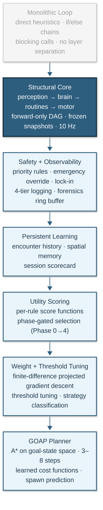

<!-- last_modified: 2026-03-25 -->

# Evolution

Historical progression of the architecture, organized by the failure modes each stage resolved.

How an autonomous agent architecture evolves from reactive if/else chains to anticipatory goal-oriented planning, and why each transition is necessary.

After the pipeline was established (Stage 2), [every subsequent addition has been purely additive](#the-invariant-each-stage-is-additive).

Classic EverQuest proved to be an exceptional sandbox for autonomous-agent research: a persistent 3D world with real-time combat, resource management, spatial reasoning, and enough environmental complexity to break every naive approach. This document describes the full arc from first prototype to the current system, developed and validated entirely within that environment. The existing docs (`architecture.md`, `design-decisions.md`, `retrospective.md`) describe the system's structure. This doc describes the journey: every transition, why it was necessary, and what it unlocked.

---

## The Progression

```
monolith -> pipeline -> priority rules -> utility scoring -> learning loops -> GOAP
```

Six stages. Each solves a specific failure mode of the previous stage. Each is additive: nothing is thrown away. The priority rules that kept the agent alive in stage 3 still keep it alive in stage 6. The learning loops that tune scoring weights in stage 5 feed cost functions for the planner in stage 6.

Every stage is implemented and validated through autonomous operation.

---

## Stage 1: The Monolith

The first version was a single Python script with nested if/else chains:

```python
while running:
    state = read_memory()
    if hp_low:
        flee()
    elif target_defeated:
        loot()
    elif mana_low:
        sit_and_med()
    elif target:
        cast_spell()
    else:
        find_target()
```

This worked for exactly one scenario: a stationary camp against weak npcs in an open zone. It failed the moment any complexity appeared.

**Why it failed:**

- **Blocking calls.** `flee()` ran a while loop until HP recovered. During that loop, the agent could not detect new threats, could not switch targets, could not respond to anything. A second NPC arriving during a flee was invisible.

- **No state persistence across ticks.** Each iteration started fresh. The agent had no concept of "I was in the middle of pulling" or "I am 3 steps into a vendor run." Multi-step behaviors were impossible.

- **No priority reasoning.** The if/else chain encoded priority by position, but adding a new behavior meant inserting it at exactly the right line. Move one condition up and the agent stops fleeing. Move it down and it never fires. At 8 conditions the chain was already fragile. At 20 it would be unmaintainable.

- **Debugging was guesswork.** When the agent died overnight, the only clue was "it died." No log of what it was doing, what state it was in, or what decision it made in the ticks before death.

The monolith proved the concept (an agent can operate autonomously in the environment) but every failure pointed at the same root cause: decisions, state, and execution were all tangled in one loop with no separation.

---

## Stage 2: The Pipeline

The first refactor decomposed the loop into four stages:

```
perception/ -> brain/ -> routines/ -> motor/
```

Each stage has a single responsibility and a strict interface:

- **Perception** produces an immutable state snapshot (frozen dataclass).
- **Brain** evaluates rules against that snapshot and selects a routine.
- **Routines** execute behavior as state machines (enter/tick/exit).
- **Motor** translates actions into synthetic keyboard input.

Data flows forward only; the [no-upward-imports invariant](architecture.md#system-overview) was established here and has never been violated.

**What this solved:**

- **Non-blocking execution.** Routines return `RUNNING` each tick instead of blocking. The brain evaluates emergency rules between every tick. A flee during combat is now a priority interrupt, not a blocked thread.

- **State persistence.** Routines track phase internally. "I am in the APPROACH phase of a pull" is explicit state, not implicit control flow position.

- **Separation of concerns.** Perception knows nothing about combat. Motor knows nothing about decisions. Each layer can be understood and modified independently.

**What this did NOT solve:** the brain was still a hardcoded if/else chain. It was now a clean chain (operating on immutable snapshots, calling routines instead of blocking functions), but still a chain. Priority was still encoded by line position. Adding a rule still meant finding the right insertion point.

---

## Stage 3: Priority Rules

The if/else chain was replaced by a declarative rule table:

```python
brain.add_rule("FLEE",          condition=should_flee,    routine=flee_routine,    emergency=True)
brain.add_rule("REST",          condition=should_rest,    routine=rest_routine)
brain.add_rule("IN_COMBAT",     condition=in_combat,      routine=combat_routine)
brain.add_rule("ACQUIRE",       condition=should_acquire, routine=acquire_routine)
brain.add_rule("WANDER",        condition=should_wander,  routine=wander_routine)
```

Rules are evaluated top-to-bottom every tick (10 Hz). First match wins. Emergency rules can interrupt locked routines. Each rule is a (condition, routine) pair registered in one of four modules (survival, combat, maintenance, navigation).

**What this solved:**

- **Declarative priority.** Adding a rule means adding one function and one registration call. No existing rule code changes. The system scaled cleanly from a handful of rules to the full set.

- **Modular organization.** Rule modules group related behaviors. Survival rules are maintained independently from combat rules.

- **Oscillation prevention.** Per-rule cooldowns prevent pathological loops (rest -> pull -> rest -> pull when mana hovers near a threshold). [Circuit breakers](architecture.md#layer-1-priority-rules-safety-envelope) suppress rules that fail repeatedly, preventing pathological retry loops.

- **Lock-in semantics.** Stage 3 introduced the ability for routines to [protect critical phases](architecture.md#layer-1-priority-rules-safety-envelope) from interruption by lower-priority rules.

Priority rules, routines, combat strategies, 12 context sub-states. The priority rule engine operated autonomously for hundreds of hours and the architecture has been additive since the pipeline decomposition, with no structural changes needed despite tripling in scope. But priority rules alone had a ceiling.

### Where priority rules hit their ceiling

Priority rules are reactive. They answer "given current state, what should I do right now?" They cannot answer:

- **"What should I do next?"** The agent rests because mana is low. It does not rest _because it is about to pull a dangerous target that requires full mana._ The decision to rest and the decision to pull are evaluated independently.

- **"Is this target worth the resource cost?"** The scoring function evaluates target quality, but the brain cannot reason about whether the encounter's mana cost will leave enough resources for the next encounter, or whether two easy encounters would yield more XP than one hard encounter.

- **"Should I change location?"** The agent wanders when nothing else fires. It does not reason about whether the current camp is productive or whether a different location would produce better outcomes.

These limitations are not bugs. They are structural: a reactive rule system evaluates the world one tick at a time. Anticipation requires a different mechanism.

---

## Stage 3.5: Persistent Learning

Before changing the decision architecture, the reactive system was extended with learning capabilities that run continuously in production. These systems record every encounter, track spatial patterns, and auto-tune parameters every 30 minutes. They operate within the priority-rule framework: they improve the inputs to decisions, not the decision mechanism itself.

### Encounter History

Each [encounter record](architecture.md#encounter-learning-per-encounter) captures duration, mana spent, HP lost, casts, pet heals, pet deaths, extra npcs, NPC level, strategy used, and more. Records are aggregated per entity type into `EntityStats` with a 30-sample rolling window.

After 5 encounters against an entity type (`MIN_FIGHTS_FOR_LEARNED = 5`), learned data overrides heuristic estimates:

- **Encounter duration prediction** feeds pull timing and resource planning.
- **Mana cost prediction** feeds rest threshold evaluation.
- **Danger score** (`min(1.0, avg_hp_lost * 2.0 + pet_death_rate * 0.5)`) feeds strategy selection and flee urgency.
- **Pet death rate** triggers strategy upgrades (switch to fear-kiting when pets die more than 30% of the time against an entity type).

Data persists across sessions in `data/memory/<zone>_fights.json`. Learned duration, mana cost, and danger scores feed directly into `score_target()` in the target scoring function, so every target selection decision uses encounter history when available. The agent genuinely improves at a camp over multiple sessions.

### Spatial Memory

A [spatial heat map](architecture.md#spatial-learning-continuous) was introduced to track where encounters occur and bias the agent toward productive areas. The formula (`1.0 + 0.1 * min(heat, 5.0)`) allows up to 50% influence on target scoring.

Rolling window limits prevent unbounded growth: 1,000 defeats, 500 sightings, 200 empty scans, 50 danger events. Spatial memory is updated in real time: combat records defeats, acquire records sightings and empty scans, wander uses `best_direction()` to bias movement toward productive cells.

### Session Scorecard

A post-session evaluation grades performance across 7 dimensions:

| Category        | Weight | What it measures                  |
| --------------- | ------ | --------------------------------- |
| Defeat rate     | 25%    | Defeats per hour                  |
| Survival        | 20%    | Deaths (70x penalty) + flees (5x) |
| Pull success    | 15%    | % of pulls reaching combat        |
| Uptime          | 15%    | % time in combat + pull           |
| Pathing         | 10%    | Stuck events per hour             |
| Mana efficiency | 10%    | Casts per defeat                  |
| Targeting       | 5%     | Tab-targets per acquire           |

The overall score produces a letter grade (A: >=90, B: >=80, C: >=70, D: >=60, F: <60). Three parameters auto-tune based on scorecard results:

- Defeat rate below 40 -> expand roam radius (+15%).
- Pull success below 50 -> tighten social add limit.
- Mana efficiency below 40 -> increase conservation level.
- Survival below 30 -> emergency: tighten both roam and npc limits.

The scorecard fires every 30 minutes during operation (`_tick_tuning_eval` in the brain runner). Tuning adjustments apply immediately to the live context and persist to `data/memory/<zone>_tuning.json`. The agent adapts its operational envelope mid-session, not just between sessions.

### What learning added, and what it couldn't

Encounter history and spatial memory made the agent measurably smarter within the reactive framework. It selects better targets, avoids unwinnable encounters, and concentrates effort in productive areas.

But the learning fed into a system that still evaluated one tick at a time. The agent learned that an NPC was dangerous, but it could not plan a sequence of actions to handle the danger. It learned that an area was productive, but it could not reason about when to move to a new area. The learning improved the _inputs_ to reactive decisions. The next stages improved the _decisions themselves_.

---

## Stage 4: Utility Scoring

The decision engine gained the ability to compare action values, not just evaluate binary conditions. Every rule was wired with a score function; all non-trivial rules produce a float reflecting "how valuable is this action right now?" The brain selects among them using one of five implemented phases, configurable at runtime via `flags.utility_phase`:

**Phase 0: Binary priority.** First rule whose condition returns True wins. Rules evaluated top-to-bottom. Identical to classical priority rules. Score functions still run but their output is ignored. This is the conservative baseline.

**Phase 1: Divergence logging.** Score functions run in parallel with Phase 0 selection. When the score-based winner differs from the priority-based winner, the divergence is logged. No behavior change; this is an observation mode for validating that score functions are reasonable before trusting them.

**Phase 2: Tier-based scoring.** Rules are grouped into priority tiers. Within each tier, the highest-scoring rule wins. Between tiers, higher priority wins. This allows the brain to choose between alternatives at the same priority level (e.g., two possible targets, two possible travel destinations) while preserving the safety hierarchy (survival rules always outrank combat rules).

**Phase 3: Weighted cross-tier scoring.** Emergency rules retain hard priority. Non-emergency rules compete by `weight * score`. The brain can choose a lower-priority rule if its score is sufficiently high. This is full utility AI: decisions are no longer strictly ordered but value-compared.

**Phase 4: Consideration-based scoring.** Rules declare scoring components as (input function, response curve, weight) tuples. The engine computes a weighted geometric mean of all consideration outputs. A zero from any consideration acts as a hard gate. Rules without considerations fall back to Phase 3 behavior. This makes score functions declarative and composable rather than monolithic.

### Why utility scoring matters

Priority rules encode a fixed preference ordering. ACQUIRE always outranks WANDER. REST always outranks ACQUIRE. This is correct for safety (FLEE must always outrank everything) but overly rigid for optimization.

Consider: the agent is at 50% mana. REST says "sit down." ACQUIRE says "there is an easy-difficulty NPC 20 units away that costs 15% mana to defeat." The priority system chooses REST because it has higher priority. A utility system would compare the value of resting now (gain 30% mana over 30 seconds) against the value of defeating the easy NPC (gain XP, loot, and still have 35% mana). For a trivial target, defeating first and resting after is strictly better.

Utility scoring makes this comparison explicit. Each rule produces a score reflecting "how valuable is this action right now?" The brain selects the highest-value action, subject to safety constraints.

### The safety envelope

Utility scoring does NOT replace priority rules. It operates _within_ them. Emergency rules (FLEE, DEATH_RECOVERY, FEIGN_DEATH) always use hard priority. Only non-emergency rules participate in utility comparison. The safety hierarchy is structural, not learned: the same [guarantee](architecture.md#layer-1-priority-rules-safety-envelope) that still holds in the current system.

This established the principle that still governs the [current decision architecture](architecture.md#decision-architecture): safety and optimization operate at different levels and never conflict.

---

## Stage 5: Learning Loops

Stage 4 gave the brain the ability to compare action values. Stage 5 closed the feedback loop: those values now improve automatically from experience.

### Scoring Weight Gradient Learning

The target scoring function evaluates 15 weighted factors (difficulty preference, distance, isolation, camp proximity, movement, loot value, heading safety, spatial heat, learned efficiency). Rather than relying on hand-tuned constants, the agent tunes these weights from encounter outcomes via finite-difference projected gradient descent:

1. After each defeat, a fitness score is computed from the encounter outcome: `fitness = f(duration, resource_spent, hp_delta, defeated)`. The fitness function is game-specific; the framework accepts any `(outcome) -> float`.

2. For each weight, the numerical partial derivative `df/dw` is estimated by perturbing the weight by a small epsilon and measuring the change in fitness contribution through centered finite differences on the observation history.

3. A projected gradient step applies: `weight += lr * gradient`, projected back into the bounded region [default * 0.8, default * 1.2]. Adaptive per-weight learning rates detect oscillation (dampen), convergence (slow), and stagnation (boost).

4. Convergence: approximately 100 defeats per zone. Weights reset on zone change.

No numpy required. The data pipeline (encounter records, score breakdowns, persistence) feeds the loop.

The agent discovers that isolation matters more than distance in a dense camp, or that difficulty preference should favor easier targets when mana efficiency is poor. What previously required a human reading session logs now happens automatically.

### Threshold Auto-Tuning

Rest entry/exit thresholds, flee urgency thresholds, and engagement distance adapt from outcome data. The system tracks resource level at engagement start against encounter survival. When the agent consistently engages at 45% mana and survives, the rest exit threshold drops. When it engages at 45% and dies, the threshold rises.

Bounded by safety floors and efficiency ceilings. The agent cannot learn to never rest or to never flee.

### Strategy Classification

The agent learns which engagement strategy works best per entity type. Strategy selection starts with level-band defaults (levels 1-7: pet tank, 8-15: pet and dot, 16-48: fear kite, 49-60: endgame) but overrides them when learned data from 5+ encounters per entity type shows >15% improvement.

The agent discovers that fear-kiting a specific entity type at level 12 is 30% more efficient than the default pet-and-dot approach. Or that pet-tanking trivial NPCs at level 40 saves enough resources to justify the slower defeat.

### The Survival Curve

The measurable outcome of Stage 5 is the **survival curve**: session performance plotted across N sessions. Session 1 uses defaults. By session 10, learned weights, tuned thresholds, and per-entity strategy selection produce measurably better defeats/hour, survival rate, and resource efficiency.

This curve is the proof that the learning loops work. It is also the central artifact for communicating the system's value: a single chart showing an agent that gets better at its job without human intervention.

---

## Stage 6: Goal-Oriented Action Planning

Stages 1 through 5 are all reactive. They answer "what should I do right now?" Stage 6 answers "what sequence of actions achieves my goals?"

### The Limitation of Reactive Decisions

With only reactive rules, the agent evaluated each rule independently. REST did not know that ACQUIRE was about to fire. ACQUIRE did not know that the target would cost 40% of remaining mana. No rule could reason about the consequence of its own activation on future rule evaluations.

This led to suboptimal sequences:

- The agent rested to 60% mana, acquired a target that cost 50% mana, then rested again. A planner rests to 80% knowing the next encounter will be expensive.

- The agent wandered randomly when no targets were available. A planner moves toward cells with predicted imminent respawns.

- The agent engaged one npc at a time. A planner reasons: "fear npc A (18-second duration), defeat npc B during the fear window, re-fear npc A," producing deliberate multi-target pulls that experienced players execute routinely.

### GOAP Architecture

The GOAP layer maintains explicit goals and searches for action sequences that achieve them.

```
Goals (survive, gain_xp, manage_resources)
  |
  v
GOAP Planner (backward-chaining search over actions)
  |
  v
Action sequence [rest_to_80%, acquire, pull, combat, loot]
  |
  v
Priority rules (safety envelope; FLEE still overrides any plan)
  |
  v
Routines (unchanged enter/tick/exit state machines)
```

Each action has preconditions and effects:

```
rest:
  preconditions: not in_combat, no nearby threats
  effects: mana = 80%, hp = 100%
  cost: learned_rest_duration (seconds)

acquire_and_defeat:
  preconditions: mana > 40%, pet alive
  effects: xp_gained, mana -= learned_mana_cost
  cost: learned_encounter_duration (seconds)
```

The planner uses A\* on the goal state space (not the terrain, which is the navigation layer's job). The search space is small: 10-20 possible actions, plans of 3-8 steps. Planning runs once per routine completion or on plan invalidation, not every tick. Budget: under 50ms per plan.

### GOAP Proposes, Priorities Dispose

The GOAP planner generates a plan, but the safety envelope from Stage 3 remains inviolable (see [Architecture](architecture.md#layer-3-goap-planner) for the full tick-by-tick mechanism).

The key historical point: the classical priority system and the GOAP planner composed without conflict because they operate at different levels.

### Learned Cost Functions

The planner's cost estimates come directly from Stage 5's learning loops:

- **Rest cost** = learned average rest duration from session data.
- **Encounter cost** = learned encounter duration per entity type from encounter history.
- **Travel cost** = learned travel time from spatial memory.
- **Flee cost** = learned recovery time from incident records.

Without learning, the planner uses heuristic costs. With learning, cost estimates converge to reality over ~100 encounters. The planner's plans improve as the cost model improves, and the same data that tunes scoring weights in Stage 5 simultaneously improves plan quality in Stage 6.

### Spawn Cycle Prediction

The planner knows when entities will be available. Defeat timestamps and locations feed a per-cell Poisson process that predicts respawn times. The planner includes "move to cell X, wait 30 seconds for respawn" as a plan step when the expected value exceeds alternatives.

This transforms wander from random exploration into directed positioning: the agent moves to where targets will be, not where they are.

### Threat Trajectory Forecasting

Entity velocity data (read from memory each tick) enables 5-10 second position prediction. The planner includes "wait 8 seconds for patrol to pass before pulling" as a plan step, avoiding a reactive flee that would otherwise interrupt the engagement.

---

## The Invariant: Each Stage Is Additive

The most important property of this progression is that no stage replaces a previous stage. Each adds a layer:

| Stage | Adds                   | Previous stages still active?      |
| ----- | ---------------------- | ---------------------------------- |
| 1     | Monolithic loop        | N/A                                |
| 2     | Pipeline decomposition | Replaces monolith (the one break)  |
| 3     | Priority rules         | Pipeline intact                    |
| 4     | Utility scoring        | Priority rules as safety envelope  |
| 5     | Learning loops         | Scoring weights, priorities intact |
| 6     | GOAP planning          | Priorities + scoring + learning    |



Stage 2 is the only destructive transition: it replaced the monolith with the pipeline. Every transition after that is additive. The pipeline absorbed every subsequent addition without structural change. That is the strongest signal a decomposition is correct: it makes room for capabilities that didn't exist when it was designed.

A Stage 6 agent still has:

- Frozen perception snapshots from Stage 2.
- Emergency priority rules from Stage 3.
- Per-rule circuit breakers from Stage 3.
- Non-blocking tick contracts from Stage 2.
- Utility scoring from Stage 4.
- Learned scoring weights from Stage 5.
- Encounter history and spatial memory from Stage 3.5.
- 4-tier forensic logging from every stage.

Nothing is thrown away. Each layer adds capability while the previous layers provide guarantees.

---

## Status

| Stage                   | Key Milestone                                                   |
| ----------------------- | --------------------------------------------------------------- |
| 1. Monolith             | Single script, if/else chains                                   |
| 2. Pipeline             | perception -> brain -> routines -> motor                        |
| 3. Priority rules       | Priority rule engine, routine state machines, combat strategies |
| 3.5 Persistent learning | Encounter history, spatial memory, scorecard auto-tuning        |
| 4. Utility scoring      | Utility scoring with phase-gated selection                      |
| 5. Learning loops       | Weight gradient, threshold tuning, strategy classification      |
| 6. GOAP                 | Goal planner, spawn prediction, trajectory forecasting          |

The architecture generalizes beyond the specific environment (see [Retrospective](retrospective.md#transferability)).
